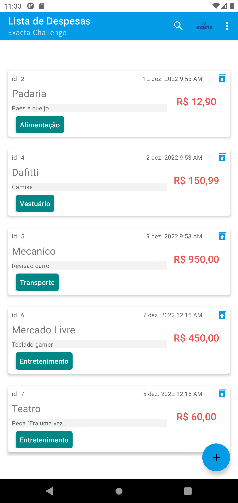
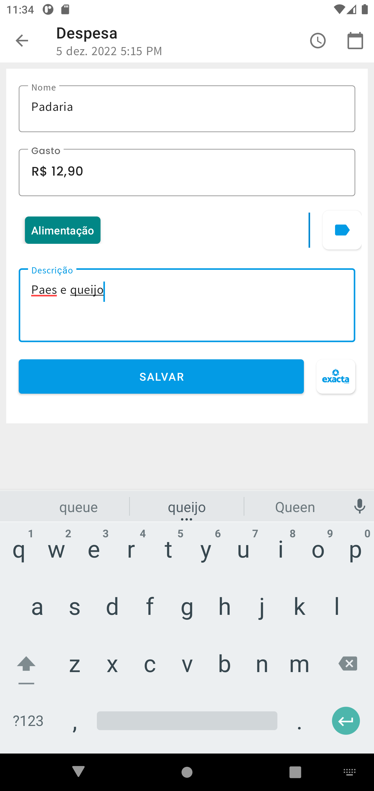

# Exacta Challenge

## Features

* Clean Architecture with MVVM
* View Components
* Kotlin Coroutines with Flow
* Room Database
* Dagger Hilt
* Navigation Component
* Retrofit
* OkHttp Interceptor
* Image manipulation

## Prerequisite

To build this project, you require:

* Android Studio Dolphin
* Gradle 7.4
* Kotlin 1.7.20
* Android Gradle Plugin 7.4

## Screenshots

<h4 align="center">

<br>

## Libraries

* [ViewModel](https://developer.android.com/topic/libraries/architecture/viewmodel) - Presenter for persisting view state across config changes
* [MutableStateFlow](https://kotlinlang.org/api/kotlinx.coroutines/kotlinx-coroutines-core/kotlinx.coroutines.flow/-mutable-state-flow) - Provides a setter for value
* [StateFlow](https://developer.android.com/kotlin/flow/stateflow-and-sharedflow) - Is a state-holder observable flow that emits the current and new state updates to its collectors
* [MutableLiveData](https://developer.android.com/reference/kotlin/androidx/lifecycle/MutableLiveData) - LiveData which publicly exposes setValue and postValue method
* [LiveData](https://developer.android.com/topic/libraries/architecture/livedata) - Is considers an observer, which is represented by the Observer class, to be in an active state if its lifecycle is in the STARTED or RESUMED state. LiveData only notifies active observers about updates
* [Room](https://developer.android.com/training/data-storage/room) - Provides abstraction layer over SQLite
* [kotlinx.coroutines](https://github.com/Kotlin/kotlinx.coroutines) - Library Support for coroutines,provides `runBlocking` coroutine builder used in tests
* [Espresso](https://developer.android.com/training/testing/espresso) - Test framework to write UI Tests
* [Dagger Hilt](https://dagger.dev/hilt) - Handles dependency injection
* [Toasty](https://github.com/GrenderG/Toasty) - The usual Toast, but with steroids
* [Retrofit](https://square.github.io/retrofit) - A type-safe HTTP client for Android and Java
* [OkHttp Interceptor](https://github.com/square/okhttp/tree/master/okhttp-logging-interceptor) - An OkHttp interceptor which logs HTTP request and response data
* [Glide](https://github.com/bumptech/glide) - A fast and efficient open source media management and image loading framework for Android that wraps media decoding, memory and disk caching, and resource pooling into a simple and easy to use interface
  
## License

```license
Copyright 2021-2022 Luiz Campos

Licensed under the Apache License, Version 2.0 (the "License");
you may not use this file except in compliance with the License.
You may obtain a copy of the License at

    http://www.apache.org/licenses/LICENSE-2.0

Unless required by applicable law or agreed to in writing, software
distributed under the License is distributed on an "AS IS" BASIS,
WITHOUT WARRANTIES OR CONDITIONS OF ANY KIND, either express or implied.
See the License for the specific language governing permissions and
limitations under the License.
```
